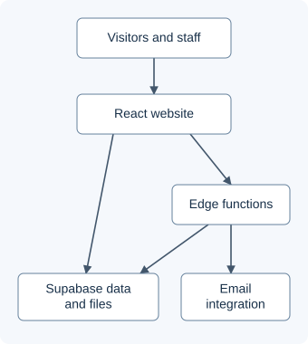

# Njord Voyage Navigator

**A maritime company website with content management, career applications, and newsletter operations.**

Visitors explore services, fleets, and vacancies; staff maintain content and review applications through an administrative interface. The engineering focus is connecting a rich React frontend to persistent content, private uploads, and email workflows.

[Architecture](docs/architecture.md) · [Validation](docs/validation.md) · [View code](examples/newsletter_batches.mjs) · [Workflow walkthrough](docs/walkthrough.md)

## Engineering highlights

- **Content without a frontend release:** database-backed news, fleet companies, vessel tables, team profiles, and vacancies have corresponding management screens.
- **Application intake across service boundaries:** validate a submission, optionally upload a CV, persist the application, then notify recruitment. Applicant acknowledgement is best-effort.
- **Bounded newsletter work:** process at most 20 active subscribers per function invocation and record recipient outcomes; the browser requests subsequent batches.
- **Separate public content from private records:** Supabase Auth, role checks, database policies, and signed CV download URLs express the intended access boundaries. Deployment enforcement has not been independently audited.

These are implementation areas evidenced in the repository, not a claim of sole authorship. The project uses existing UI libraries and generated integration scaffolding.

## Verified evidence

| Area | Evidence and scope |
|---|---|
| Application surface | 37 route declarations: 15 administrative, 21 other explicit routes, 1 catch-all |
| Backend scope | 7 edge-function entrypoints and 35 SQL migration files |
| Build | Production Vite build completed locally |
| Existing lint | 28 errors and 18 warnings; not a clean quality gate |
| Showcase example | 7/7 synthetic diagnostic scenarios passed |

Counts describe code scope, not users, traffic, or deployed services. The example measures an illustrative model, not email delivery reliability. [Methods and limitations](docs/validation.md) · [Aggregate evidence](evidence/metrics.json)

## How it fits together

Public pages read content directly; privileged workflows cross explicit backend boundaries. Static frontend hosting and deployed configuration are not independently verified. [Detailed data flows](docs/architecture.md)

## A decision worth inspecting

A newsletter containing selected articles can outlast one function request. The implementation limits each request to **20 subscribers** and lets the administrative browser continue with a send identifier.

In the [runnable example](examples/README.md), 45 synthetic recipients produce batches of **20, 20, and 5**. A failed recipient still counts as processed. A second diagnostic demonstrates why counting completed records and offsetting into a changing subscriber list can skip a recipient after an unsubscribe.

The tradeoff is explicit: bounded requests and visible progress, with no durable worker, recipient snapshot, or exactly-once guarantee. [View the illustrative code](examples/newsletter_batches.mjs)

## Workflows

- **Visitors:** browse company and fleet information, read news, view sea and shore vacancies, and subscribe to updates.
- **Applicants:** submit a sea-career form with an optional PDF or DOCX CV; shore vacancies use an email application link.
- **Staff:** maintain content and job listings, review application statuses, obtain temporary CV links, preview newsletters, and inspect send history.

[Follow a synthetic workflow](docs/walkthrough.md). No production session or personal records are needed to explore this showcase.

## Technology

- **Frontend:** React 18, TypeScript, Vite, React Router, TanStack Query.
- **Interface:** Tailwind CSS, shadcn/ui and Radix components; Three.js packages support globe-related UI code.
- **Backend:** Supabase PostgreSQL, Auth, Storage, and Deno edge functions.
- **Email:** Microsoft Outlook through an integration gateway.
- **Verification:** local production build, ESLint, and Node.js assertions for the showcase example.

## Access and scope

This public repository contains reviewed documentation, diagrams, aggregate validation evidence, and a newly written illustrative example. The full application, environment configuration, operational data, CVs, subscriber records, media assets, and original Git history remain private. No open-source license is granted here.

Capabilities above are verified in the current source snapshot; live deployment, personal contribution attribution, and business outcomes require separate evidence. This showcase contains no live demo or product screenshots. The walkthrough is textual and synthetic.
