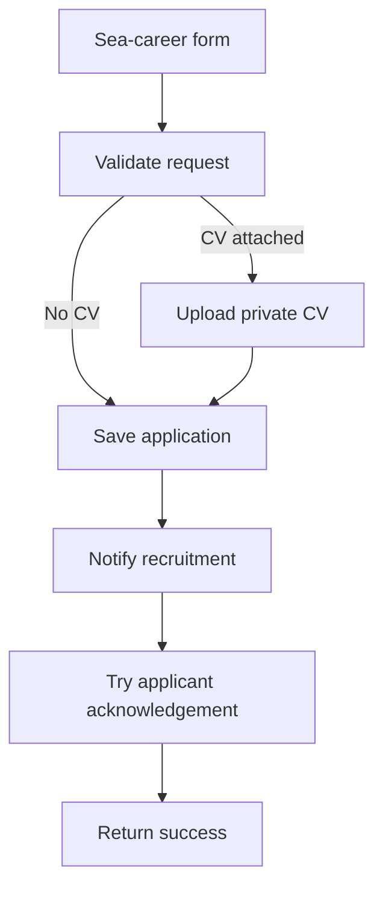
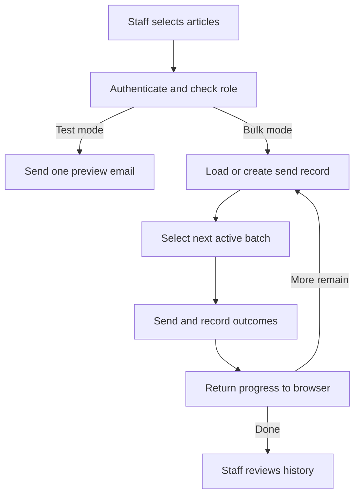

# Architecture and engineering decisions

[Back to project overview](../README.md) · [Validation](validation.md) · [Walkthrough](walkthrough.md)

## Component responsibilities

The React single-page application uses React Router for navigation. Public pages combine static content with Supabase queries. Management screens edit content, upload imagery, maintain vacancies, and review applications. TanStack Query is available at the application root; individual screens also use direct calls and local state.

Supabase holds structured content, roles, applications, and newsletter state. Storage separates media from CV attachments. Edge functions implement application intake, newsletter sending and unsubscribe, sitemap generation, and administrative utilities. The presence of a function in source does not establish that it is deployed.

## Public content and staff edits

Public pages read content through the browser client. Staff sign in and use management forms; role checks in the interface are paired with database policies in the migrations. Public-readable media and private CVs serve different purposes. Applications request a 60-second signed CV URL for staff downloads.

Frontend assets are produced by Vite. Database/storage and edge functions are separate service boundaries. No committed CI workflow or complete frontend deployment manifest was found. Historical migrations describe intended schema evolution, not a verified inventory of the live database.

## Career application flow

The server checks required fields and email shape. An optional CV is restricted by filename extension to PDF/DOCX and by size to 10 MiB (the UI calls this 10 MB). These are not malware scanning or full document-content validation. A honeypot branch returns apparent success without processing; normal validation failures return an error before persistence.

CV upload precedes the database insert, which precedes the recruitment email. These operations are not one transaction: upload or persistence may succeed before a later failure. There is no demonstrated compensation or idempotency key. Recruitment email failure returns an error after persistence; an applicant retry can therefore duplicate work. Acknowledgement failure is logged and still returns success. The UI's confirmation-email wording is stronger than this best-effort guarantee.

## Newsletter processing

The loop back to the send record is a **new browser request**, not an autonomous background worker. Bulk requests take at most 20 recipients, send sequentially, and wait 250 ms between attempts. Article ordering follows staff selection. Test mode bypasses the bulk-send ledger. Per-recipient success/failure records support history and progress.

Continuation uses the count of recorded recipients as an offset into the current active subscriber list, ordered by subscription time and identifier. This avoids one long request, but changing membership can shift offsets. Concurrent continuation, a crash after email delivery but before recording, and unchecked ledger write errors can also compromise accounting. No exactly-once or automatic retry guarantee is claimed. Keeping the staff browser open is required by the existing workflow.

The unsubscribe function validates a token; GET looks up its state and POST deactivates the subscription.

## Failure handling and observability

Forms show toast errors and loading states. The edge functions return status/error payloads and write console diagnostics. Newsletter history exposes send counters and per-recipient outcomes; application staff can update review statuses. These are implemented diagnostic surfaces, not evidence of centralized tracing, alerting, or an uptime objective. Private logs are excluded from this showcase.

## Evolution and limits

Migration history includes tightening storage writes to administrative roles, removing a self-assigned-role policy, and adding application/newsletter records. Older page components and the earlier job-openings schema remain in the tree; they are not counted as additional active product capabilities unless routed or used by the current code.

Potential next steps include a durable newsletter worker, immutable recipient selection, idempotent delivery bookkeeping, and transactional recovery around application side effects. These are recommendations, not completed features. [The diagnostic example](../examples/README.md) makes one current tradeoff reproducible without contacting any service.
